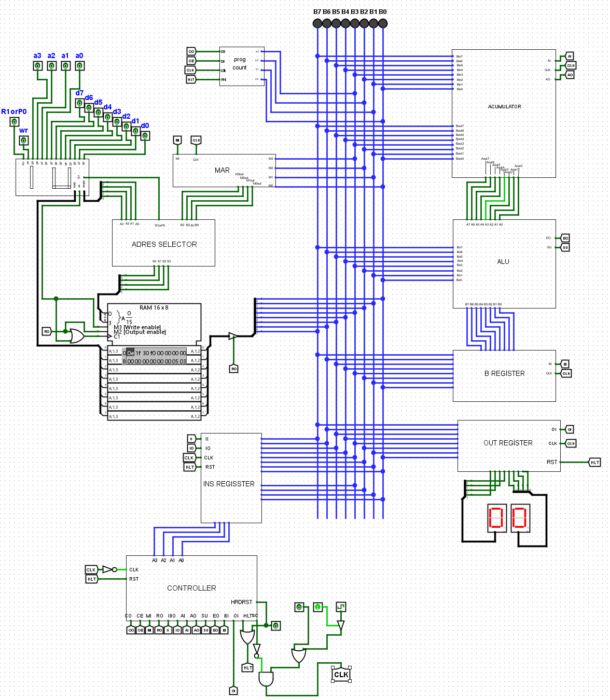
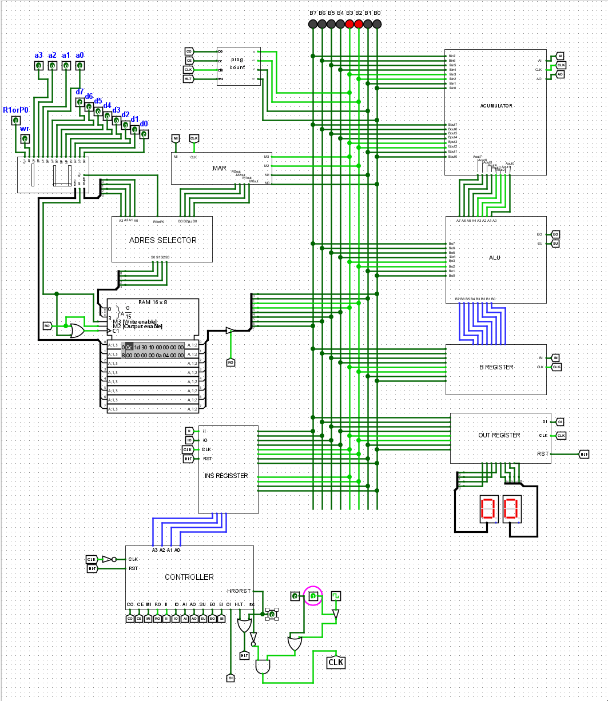

# **SAP-1: 8-Bit Bilgisayar Tasarımı (Logisim Evolution)**

Bu repo, Albert Paul Malvino'nun "Digital Computer Electronics" kitabında tanıtılan **SAP-1 (Simple-As-Possible-1)** bilgisayarının **Logisim Evolution** yazılımı üzerinde sıfırdan tasarlanmış bir simülasyonunu içerir. Proje, bir mikroişlemcinin temel çalışma prensiplerini ve bilgisayar mimarisinin temel yapı taşlarını anlamak amacıyla eğitim amaçlı olarak geliştirilmiştir.

## **Projenin Amacı**

Bu projenin temel amacı, bir bilgisayarın en temel seviyede komutları nasıl işlediğini (Fetch-Decode-Execute döngüsü) uygulamalı olarak görmektir. Sadece temel mantık kapıları kullanılarak modern bir bilgisayarın atası olan bu basit makinenin nasıl hayata geçirilebileceğini göstermek hedeflenmiştir.

## **Teknik Özellikler**

* **Veri Yolu (Data Bus):** 8-bit
* **Adres Yolu (Address Bus):** 4-bit
* **RAM:** 16 x 8-bit (16 byte kapasiteli)
* **Komut Seti:** 5 adet temel komut (LDA, ADD, SUB, OUT, HLT)
* **Aritmetik İşlemler:** Toplama ve Çıkarma
* **Çıkış:** 8-bit'lik bir çıkış portu (7-segment display veya LED'lere bağlanabilir)

## **Mimari ve Bileşenler**

SAP-1 mimarisi, bir W Veriyolu (W-Bus) etrafında toplanmış temel bileşenlerden oluşur:

* **Program Sayacı (Program Counter - PC):** Bir sonraki komutun 4-bit'lik bellek adresini tutar.
* **Bellek Adres Yazmacı (Memory Address Register - MAR):** PC'den gelen adresi RAM'e göndermeden önce ara bellek olarak saklar.
* **RAM (16x8):** Program komutlarını ve verileri depolar.
* **Komut Yazmacı (Instruction Register - IR):** O an işlenmekte olan 8-bit'lik komutu (4-bit opcode + 4-bit operand) tutar.
* **Kontrol Sıralayıcı (Controller/Sequencer):** IR'den gelen opcode'a göre tüm sistemi yöneten kontrol sinyallerini üretir. Bu devrenin kalbidir.
* **Akümülatör (Accumulator - A):** Aritmetik işlemlerin sonucunu tutan ve ALU'nun ana giriş/çıkış yazmacı olan 8-bit'lik bir yazmaçtır.
* **ALU (Aritmetik Mantık Birimi):** Akümülatör ve B Yazmacı'ndan gelen verilerle toplama ve çıkarma işlemlerini yapar.
* **B Yazmacı (B Register):** Aritmetik işlemler için ikinci veriyi geçici olarak tutar.
* **Çıkış Yazmacı (Output Register - OUT):** Akümülatör'deki veriyi alarak dış dünyaya (LED'ler, display vb.) gösterir.

## **Nasıl Kullanılır?**

1.  **Logisim Evolution** yazılımının en güncel sürümünü [buradan](https://github.com/logisim-evolution/logisim-evolution/releases) indirin.
2.  Bu repoyu klonlayın veya `.circ` dosyasını indirin.
3.  `sap-1.circ` dosyasını Logisim Evolution ile açın.
4.  **Programlama:**
    * Devredeki "Programlama Modu" anahtarını aktif hale getirin.
    * Manuel adres ve veri giriş pinlerini kullanarak programınızı RAM'e satır satır yazın.
    * Her satırı yazdıktan sonra "Manuel Yazma" (Write) clock sinyalini tetikleyin.
5.  **Çalıştırma:**
    * "Programlama Modu" anahtarını devre dışı bırakarak "Çalıştırma Modu"na geçin.
    * "RESET" butonuna basarak Program Sayacı'nı sıfırlayın.
    * "MANUAL CLOCK" butonuna basarak programı adım adım çalıştırın veya "OTOMATİK CLOCK" devresini aktif ederek programın otomatik çalışmasını izleyin.

## **Komut Seti Mimarisi (ISA)**

SAP-1, 5 temel komuttan oluşan basit bir komut setine sahiptir. Her komutun ilk 4-biti **Opcode**, son 4-biti ise **Operand** (adres) olarak kullanılır.

| Komut (Mnemonic) | Opcode (İkili) | Açıklama                                                                          |
| :--------------- | :------------- | :-------------------------------------------------------------------------------- |
| `LDA`            | `0000`         | **LoaD Accumulator:** Belirtilen adresteki veriyi Akümülatöre yükler.               |
| `ADD`            | `0001`         | Belirtilen adresteki veri ile Akümülatör'deki veriyi toplar, sonucu Akümülatör'e yazar. |
| `SUB`            | `0010`         | Belirtilen adresteki veriyi Akümülatör'deki veriden çıkarır, sonucu Akümülatör'e yazar. |
| `OUT`            | `0011`         | Akümülatör'deki veriyi Çıkış Yazmacı'na gönderir. Operand kısmı kullanılmaz.      |
| `HLT`            | `1111`         | **HaLT:** İşlemciyi (clock sinyalini) durdurur.                                     |

## **Örnek Program: `10 + 4 = 14`**

Aşağıdaki program, `10` ve `4` sayılarını toplayıp sonucu `14` (Hex: E) olarak çıkışta gösterir.

**RAM'e Yüklenecek Kod:**

| Adres (Hex) | Komut / Veri (Binary) | Açıklama          |
| :---------- | :-------------------- | :---------------- |
| `0`         | `0000 1100`           | LDA 12 (C)        |
| `1`         | `0001 1101`           | ADD 13 (D)        |
| `2`         | `0011 0000`           | OUT               |
| `3`         | `1111 0000`           | HLT               |
| ...         | ...                   | ...               |
| `C` (12)    | `0000 1010`           | Veri: **10** |
| `D` (13)    | `0000 0100`           | Veri: **4** |

Program çalıştırıldığında, Çıkış Yazmacı'na bağlı olan göstergede `0000 1110` (Decimal: 14, Hex: E) değeri görünecektir.

## **Yazar**

* **Muhammet Ali Kaya**
* **LinkedIn:** [[Profilinize Gidin](https://www.linkedin.com/in/muhammet-ali-kaya-88b676216/)]
* **GitHub:** [[Profilinize Gidin](https://github.com/MuhammetAliKaya)]